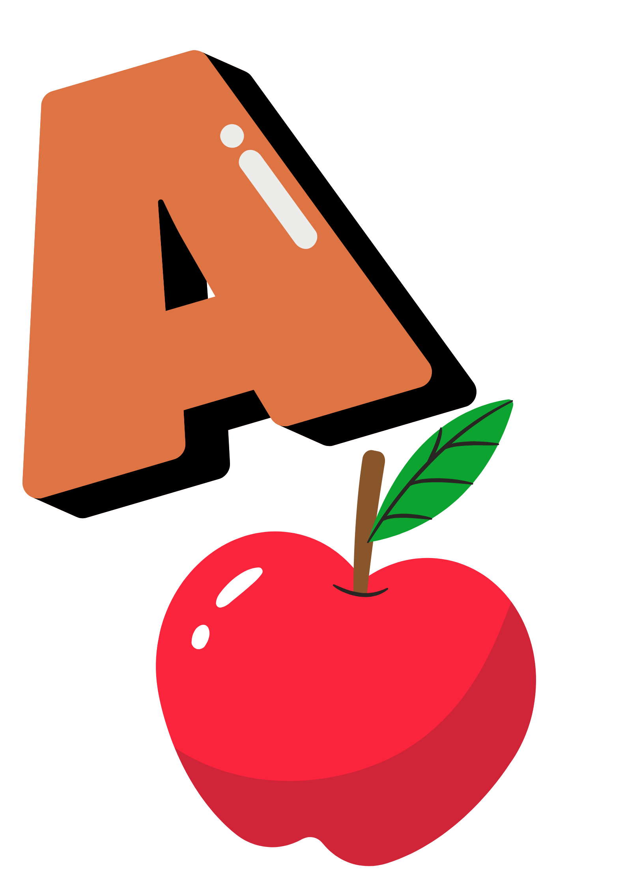

# AR Flashcards for Kids - Alphabet Learning
 

*A captivating visual of the AR application in use.*

## 🌟 Project Overview

This **Unity 3D Augmented Reality (AR) application** is a functional prototype developed in **Unity 2022** using the **3D Render Pipeline**. It provides a fun, immersive way for young children to learn the English alphabet by bringing digital 3D letter models to life via physical flashcards.

Developed during a hackathon, this project demonstrates rapid prototyping, effective asset integration, and a user-centric approach to educational software, focusing on core AR functionality within the Unity editor environment.

## ✨ Features

* **Augmented Reality (AR):** Utilizes **Vuforia Engine** for real-time detection of physical flashcards and overlaying 3D letter models.
* **Interactive 3D Models:** Displays vibrant 3D alphabet models on detected flashcards.
* **Audio Pronunciation:** Tapping 3D letters plays their pronunciation for auditory reinforcement.
* **Intuitive UI:** Simple, child-friendly interface for easy interaction.
* **Subtle Animations:** Continuous rotation of 3D models enhances visual appeal.

## 🛠️ Technologies Used & Asset Sourcing

* **Unity 3D Engine (Version 2022):** Core development environment for AR application, scene, and asset management, utilizing the **3D Render Pipeline**.
* **C# Scripting:** Implements core game logic, UI interactions, and AR functionalities.
* **Vuforia AR SDK:** Robust image target detection and AR object tracking.
* **Canva:** Used for designing and creating the physical alphabet flashcards.
* **Online 3D Model Repositories:** 3D models were sourced from online websites to facilitate rapid prototyping.
* **Online Audio Tools:** MP3 audio files for pronunciation were generated using online platforms.
* **Git & GitHub:** Version control for project management.

## 🚀 Key Learnings & My Contribution

This project was a significant learning experience, allowing me to gain practical skills in several areas:

* **Unity 3D Development:** Hands-on experience with the Unity Editor, scene setup, GameObject manipulation, and building interactive applications.
* **Augmented Reality (AR):** Implemented AR features using Vuforia, focusing on target detection and dynamic object visibility.
* **UI/UX Design:** Designed and integrated user interface elements to create an intuitive and child-friendly experience.
* **Asset Sourcing & Integration:** Gained experience in efficiently sourcing and integrating various asset types (flashcard designs from Canva, 3D models, and audio files) from online platforms for rapid development.
* **Problem-Solving & Rapid Prototyping:** Demonstrated ability to quickly develop a functional proof-of-concept within the Unity editor under hackathon time pressure.
* **Technical Communication:** Developed skills in documenting project structure and functionality.

### **Understanding the Code (AI-Assisted Development)**

For this hackathon project, to efficiently prototype the core interactive logic within the time constraints, some initial C# scripts were generated with the assistance of AI tools, as advised during the event. My primary focus was then on:

* **Thorough Comprehension:** Deeply analyzing and understanding the functionality, purpose, and interaction of each line of code within Unity's lifecycle.
    * **`VuforiaObjectVisibility.cs`:** This script is central to the AR functionality. I understand how it leverages Vuforia's `OnTargetFound` and `OnTargetLost` callbacks to dynamically enable/disable the renderers and colliders of 3D objects, ensuring they appear and disappear seamlessly with the AR marker.
    * **`RotationController.cs`:** I understand how this script utilizes Unity's `Update()` method and `transform.Rotate()` to apply continuous, frame-rate independent rotation to the 3D models, adding visual dynamism.
    * **`PlayAudioOnButton.cs`:** I comprehend how this script connects UI button clicks to audio playback, including handling the `AudioSource` component and basic null checks to ensure robust audio functionality.
* **Responsible Tool Usage:** This process significantly enhanced my ability to work with existing codebases, debug, and leverage modern development tools responsibly while gaining a deep understanding of the underlying logic. I am actively continuing my intensive self-study in C# scripting to confidently write and modify such code independently.

## 📸 Screenshots / Demo

### Visual Demonstration (GIF)


*A short visual demonstration of the AR application in action, showcasing physical flashcard detection and the overlay of an interactive 3D letter model. Please note that GIFs do not support sound.*

---

### Static Screenshots


*The 3D apple model appearing in augmented reality on its corresponding flashcard.*


*The 3D bag model displayed in the AR environment.*


*The 3D dog model interacting with its flashcard in augmented reality.*

---

### Audio Interaction Demo (Video)

For a full demonstration including the interactive audio pronunciation of letters A, B, C, and D, please watch this short video:

[Watch AR Flashcards Audio Demo on Google Drive](https://drive.google.com/file/d/1yeRYBVQGD-sePHtgScm0qFo8ZX5Oilbs/view?usp=sharing)
(https://drive.google.com/file/d/1zep5O14ft3OssDtSlXdAMjtILPgGZGlS/view?usp=sharing)(https://drive.google.com/file/d/1hhlXK2sYTBVWneVLpeOoYvxT7WEMJ8D1/view?usp=sharing)
*(Click the link above to view the video with sound.)*

## 📂 Project Structure & Editor View

To provide insight into the project's organization and asset management within the Unity Editor:

### Unity Hierarchy View

    
*A glimpse into the Unity Hierarchy window, showcasing the structured arrangement of GameObjects and Image Targets for each alphabet letter.*

### Unity Assets Folder View

    
*An overview of the project's Assets folder, demonstrating the organization of 3D models, audio files, scripts, and other resources.*

## 🚀 How to Run the Project

1.  **Clone the repository:**
    ```bash
    git clone (https://github.com/12345-12345-12345/AR_Flashcards_Vuforia_Kids.git)
    ```

2.  **Open in Unity:** Open the cloned `AR_Flashcards_Vuforia_Kids` folder as a project in Unity Hub (using **Unity version 2022.x** or newer, compatible with Vuforia Engine).
3.  **Run in Editor:** The project is configured to run within the Unity editor for demonstration purposes. Follow standard Unity/Vuforia procedures to set up your webcam/device for AR testing in the editor. *(Note: Full mobile app build and deployment were outside the scope of this hackathon prototype.)*

## 🤝 Connect with Me

* **LinkedIn:** [My LinkedIn Profile](https://www.linkedin.com/in/maha-lakshmi-13a1a8269)
* **GitHub:** [My GitHub Repository](https://github.com/12345-12345-12345/AR_Flashcards_Vuforia_Kids.git)
